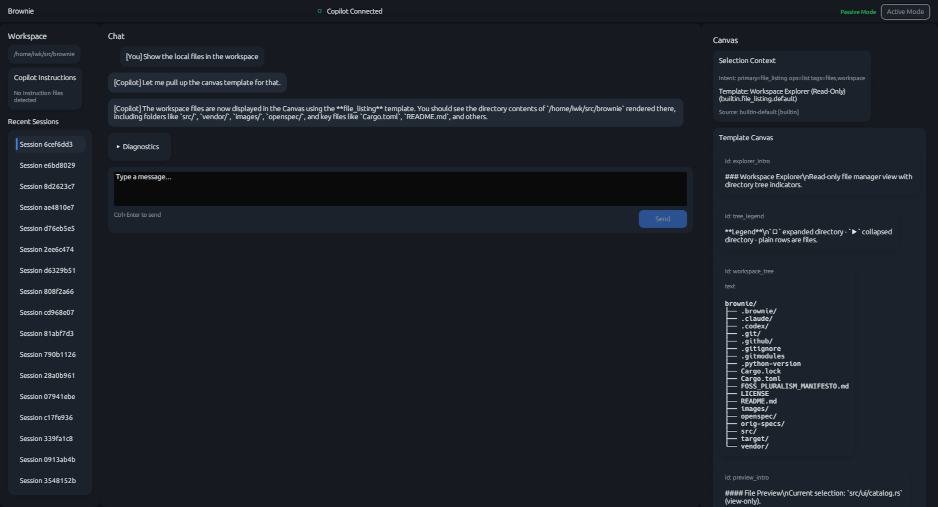

# Brownie

[](https://www.rust-lang.org)
[](LICENSE)
[](https://github.com/github/copilot-sdk)
[](FOSS_PLURALISM_MANIFESTO.md)


> Brownie, Your helpfull AI assistant. Treat it well.

Brownie is a native desktop application that embeds GitHub Copilot agentic workflows in a structured execution shell. It is not a sidebar. It is a surface where your AI assistant works alongside you — sends and receives messages in real time, runs in passive mode by default, and persists your sessions locally.

This release (SPEC-1) establishes the execution backbone: a stable, observable connection to the Copilot CLI via the community Rust SDK, a three-column UI shell, streaming chat, and local session persistence. Dynamic UI rendering and the action canvas are coming in the next spec.

## Prerequisites

- **Rust 1.85+** (edition 2021) — `rustup update stable`
- **GitHub Copilot CLI** installed and authenticated on your PATH
  - Install: follow the [Copilot CLI installation guide](https://docs.github.com/en/copilot/how-tos/set-up/install-copilot-cli)
  - Verify: `copilot --version`
- A valid GitHub Copilot subscription (free tier works)

## Build

```bash
git clone --recurse-submodules https://github.com/your-org/brownie
cd brownie
cargo build --release
```

The binary lands at `target/release/brownie`. No installer, no runtime dependencies beyond the Copilot CLI.

## Run

```bash
# Run from your project directory — Brownie uses the CWD as the workspace
cd /your/project
brownie
```

## What You Get


> Note that this is still a 'work-in-progress'. The real beauty of your brownie will be coming apparent very soon.

The window is a three-column layout with a dark theme:

| Column | Label | Contents |
| --- | --- | --- |
| Left | **Workspace** | Active workspace path · detected instruction files (`.github/copilot-instructions.md`, `AGENTS.md`, `*.instructions.md`) · recent session list |
| Center | **Chat** | Streaming conversation transcript · collapsible diagnostics log · input bar |
| Right | **Actions Panel** | Placeholder — dynamic canvas in a future spec |

**Top bar:** connection status (color-coded) · Passive Mode indicator · disabled Active Mode toggle.

### Passive Mode

All tool calls are blocked at three independent layers: the CLI is started with `--deny-tool *`, the SDK permission handler returns `denied` by default, and the application has no code path to approve tool calls. Any tool-call events that arrive are logged to the diagnostics panel.

### Session Persistence

Sessions are stored as JSON files at `~/.brownie/sessions/<session-id>.json`. Writes are atomic (write to `.tmp`, then rename). Sessions reload on restart and appear in the left panel in reverse chronological order.

## Project Structure

```text
src/
  main.rs          — entry point; instruction file detection; eframe wiring
  app.rs           — egui App; three-column layout; event drain loop
  event.rs         — AppEvent enum bridging async SDK events to the UI thread
  copilot/mod.rs   — CopilotClient; SDK lifecycle; streaming event mapping
  session/
    mod.rs         — SessionMeta and Message types
    store.rs       — atomic filesystem persistence (~/.brownie/sessions/)
vendor/
  copilot-sdk-rust/  — community Rust SDK (git submodule)
```

## SPEC-1 Scope

This release validates the execution spine. What works:

- Connect to Copilot CLI via the Rust SDK (stdio transport, auto-restart on crash)
- Create a session bound to the current workspace
- Send messages and receive streaming responses in the transcript
- Passive mode enforced unconditionally
- Connection status visible in the top bar; errors and suppressed tool calls in the diagnostics panel
- Session transcript persisted locally and reloadable from the session list

What is explicitly **not** in this release:

- Dynamic canvas / UiSchema rendering (Actions Panel is a static placeholder)
- Active mode and tool approval
- UI catalog, intent resolution, template promotion
- Workspace selector (uses CWD; manual override planned for a later spec)

## Configuration

No config file yet — planned for `~/.brownie/config.toml` in a later spec.

If your `copilot` binary is not on PATH, set `COPILOT_CLI_PATH` to its full path before launching Brownie.

## Principles of Participation

Everyone is invited and welcome to contribute: open issues, propose pull requests, share ideas, or help improve documentation. Participation is open to all, regardless of background or viewpoint. 

This project follows the [FOSS Pluralism Manifesto](./FOSS_PLURALISM_MANIFESTO.md), which affirms respect for people, freedom to critique ideas, and space for diverse perspectives. 

## License and Copyright

Copyright (c) 2026, Iwan van der Kleijn

This project is licensed under the MIT License. See the [LICENSE](LICENSE) file for details.
